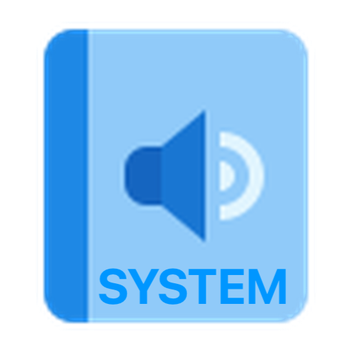
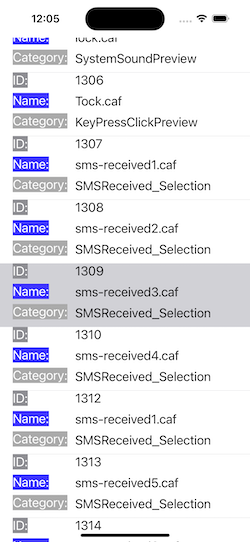

# ParseSystemSounds
iOS System Sounds

# Functionality:

* List of system sounds parsed into their json file
* This code work on the Simulator
* Parses system sound id, system sound name and category into the table
* Select the value in table mode, listen selected
* And use it in your program using the framework AudioToolbox 

A small iOS project that will play known system sounds.

Using information sourced from https://github.com/gromozekapp/parseSystemSounds

|  |  |
| ---------------------------- | ------------------------------------ |

