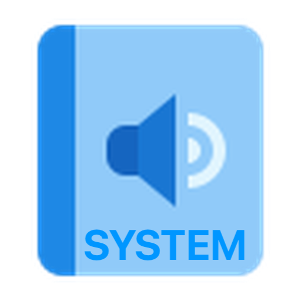
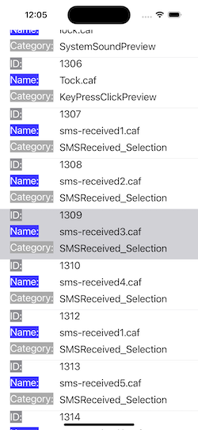

# ParseSystemSounds

A small iOS demo that parses and plays [iOS system sounds](https://github.com/gromozekapp/ParseSystemSounds) using AudioToolbox.

[]()
[]()

---

## Features

- Parses system sound IDs, names, and categories into JSON
- Table view with selectable sounds
- Play any system sound on tap
- Works in Simulator and on device

---

## Screenshots

| | |
|---|---|
|  |  |

---

## Usage in Your Project

```swift
import AudioToolbox

// Play a system sound by ID
AudioServicesPlaySystemSound(1000)
```

Use the parsed JSON mapping to discover sound IDs and names.

---

## Getting Started

```bash
git clone https://github.com/gromozekapp/ParseSystemSounds.git
cd ParseSystemSounds
open ParseSystemSounds.xcodeproj
```

Select a simulator or device → Run (`⌘R`).

---

## Requirements

- iOS (Simulator or device)
- Xcode 14+

---

## Note

Portfolio / utility demo project.
